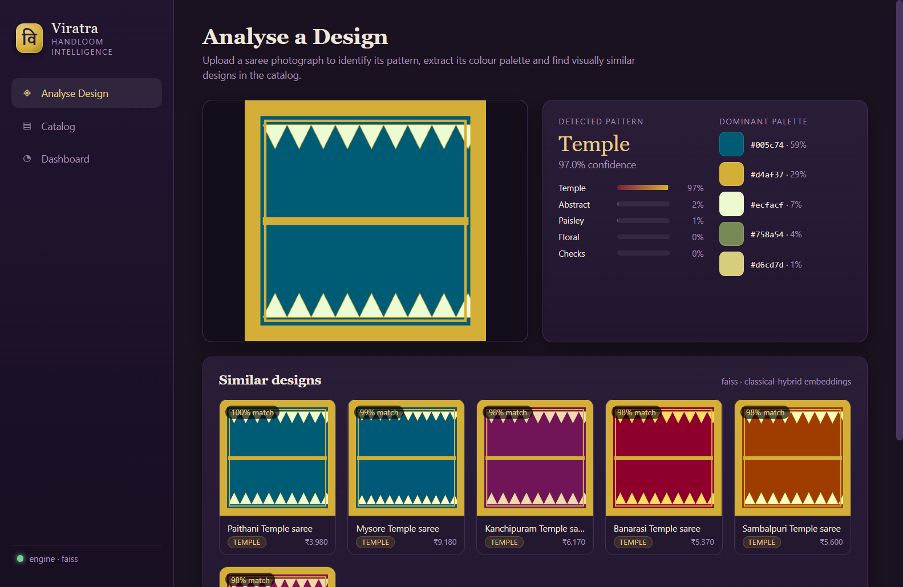
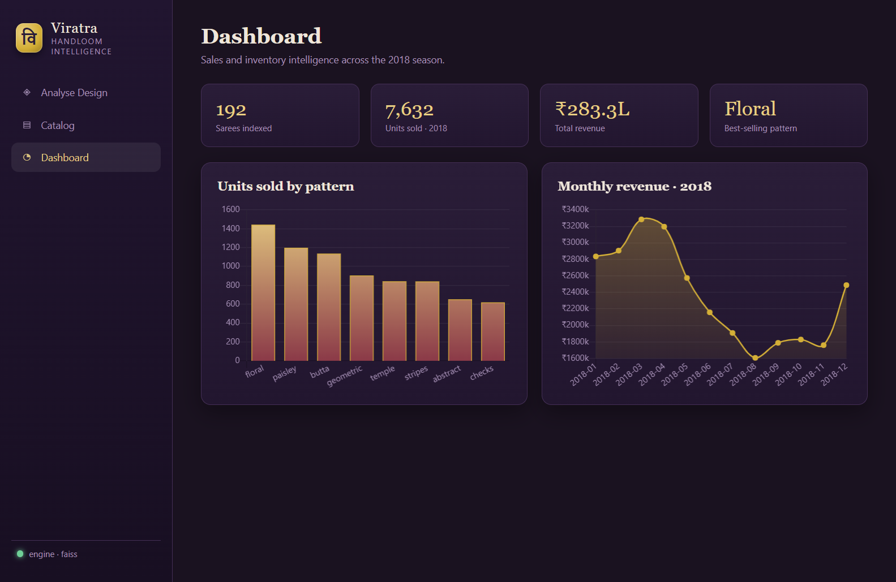
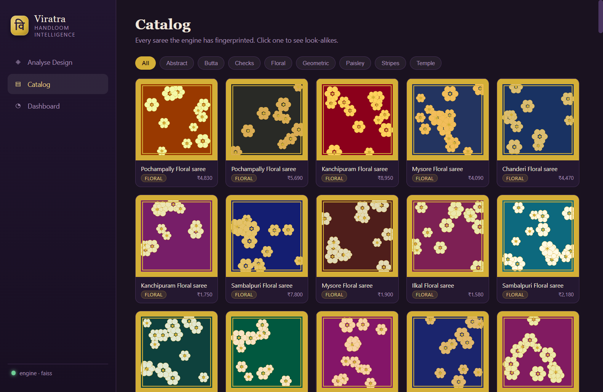

# Viratra Handloom — Saree Design Intelligence

> A desktop application that looks at a photograph of a saree and tells you what
> it is: its **pattern** (floral, paisley, temple, checks, stripes, geometric,
> butta, abstract), its **dominant colour palette**, and the **visually similar
> designs** already in the shop's catalog — plus a sales dashboard to see which
> designs actually sell.

Built for a handloom retailer to make sense of a large, fast-changing saree
inventory. An Electron front-end drives a Python computer-vision + machine-learning
engine: classical OpenCV/scikit-image features feed a pattern classifier, a deep
"design fingerprint" powers a FAISS similarity index, and Chart.js renders the
analytics.

<p align="center">
  
</p>

---

## Retrospective build

This repository is a **2018 retrospective** — a clean-room rebuild of a system I
prototyped for a handloom business, reconstructed from the original research
trail, mapping every layer to a datable 2018-or-earlier source (OpenCV
tutorials, PyImageSearch, the Keras blog, FAISS, DeepFashion, …).

Two honest notes carried over from that analysis:

- **The saree taxonomy is bespoke.** No single 2018 paper defines the eight
  pattern classes — they are hand-curated domain knowledge (see
  [`config/taxonomy.json`](config/taxonomy.json)), trained on a labelled set.
- **The deep-feature backend degrades gracefully.** The original build pulled
  512-d VGG16 bottleneck features (Keras/TensorFlow). Where TensorFlow isn't
  available, the engine falls back to a deterministic classical descriptor
  (HSV histogram + LBP + Gabor + HOG). Both produce an L2-normalised embedding,
  so similarity search is identical either way.

The sample swatches in `data/samples/` are **procedurally generated** (see
[`scripts/generate_samples.py`](scripts/generate_samples.py)) so the whole
pipeline trains and runs reproducibly with no third-party image licensing. Drop
real shop photos into `data/samples/real/` to analyse them at any time.

---

## Architecture

```
 Electron renderer  ──IPC──▶  Electron main  ──stdio(JSON)──▶  Python engine
   (HTML/CSS/JS,               (main.js,                        (viratra/ package,
    Chart.js)                   python-bridge)                   scripts/serve.py)
                                                                     │
                                          ┌──────────────────────────┼───────────────┐
                                       SQLite                     FAISS index      sklearn models
                                     (catalog+sales)            (fingerprints)    (pattern clf, sales)
```

The ten blueprint layers map onto the code as follows:

| # | Layer | Implementation |
|---|-------|----------------|
| 1 | Electron desktop UI | [`app/main.js`](app/main.js), [`app/renderer/`](app/renderer/) |
| 2 | SQLite storage | [`viratra/db.py`](viratra/db.py) |
| 3 | OpenCV preprocessing | [`viratra/preprocess.py`](viratra/preprocess.py) |
| 4 | Pattern recognition (RF/SVM) | [`viratra/patterns.py`](viratra/patterns.py) |
| 5 | Colour intelligence (k-means, histograms) | [`viratra/color.py`](viratra/color.py) |
| 6 | Texture analysis (LBP, Gabor) | [`viratra/texture.py`](viratra/texture.py) |
| 7 | Deep fingerprint (VGG16 / classical) | [`viratra/embeddings.py`](viratra/embeddings.py) |
| 8 | Similarity search (FAISS / NN) | [`viratra/search.py`](viratra/search.py) |
| 9 | Sales prediction (regression) | [`viratra/sales.py`](viratra/sales.py) |
| 10 | Recommendation + Chart.js + Node↔Python bridge | [`app/renderer/charts.js`](app/renderer/charts.js), [`app/ipc/python-bridge.js`](app/ipc/python-bridge.js) |

Everything is tied together by [`viratra/pipeline.py`](viratra/pipeline.py) (the
`Engine`) and exposed over a JSON line-protocol in
[`scripts/serve.py`](scripts/serve.py).

---

## Quick start

**Prerequisites:** Python 3.x, Node.js 16+.

```bash
# 1. Python engine
python -m venv .venv
# Windows:  .venv\Scripts\activate      macOS/Linux:  source .venv/bin/activate
pip install -r requirements.txt

# 2. Build all artifacts (samples → catalog → classifier → index → sales model)
python scripts/build_all.py

# 3. Desktop app
npm install
npm start
```

`build_all.py` prints a held-out classification report; a fresh run scores
**~95–98% accuracy** across the eight pattern classes on the synthetic set.

### Command-line interface

Prefer the terminal? The engine is fully scriptable:

```bash
python cli/viratra.py analyze data/samples/paisley/paisley_03.png
python cli/viratra.py catalog --limit 10
python cli/viratra.py stats
```

```
Pattern: Paisley  (93.1% confidence)
  top-3: paisley 93%, abstract 4%, floral 2%
Dominant colours:
  ▇ #4a1030  61%   ▇ #d4af37  22%   ▇ #efd9a0  9% …
Similar designs:
  [1.000] VH-PAI-003   Banarasi Paisley saree     paisley
  [0.981] VH-PAI-011   Chanderi Paisley saree     paisley …
```

---

## How analysis works

For each image the `Engine`:

1. **Normalises** it (resize → grayscale/HSV) — `preprocess.prepare`.
2. **Extracts colours** with k-means over the pixels — `color.dominant_colors`.
3. **Classifies the pattern** from a colour-histogram + LBP + Gabor + shape
   feature vector through a scaled RandomForest — `patterns` + `pipeline.classify`.
4. **Computes the design fingerprint** (VGG16 or classical, L2-normalised) —
   `embeddings.embed`.
5. **Finds look-alikes** by inner-product (cosine) search over the FAISS index,
   resolving hits back to catalog records — `search` + `pipeline.similar`.

The dashboard joins each saree's attributes to its 2018 sales history and trains
a RandomForest regressor to surface the demand drivers — `sales.SalesModel`.

---

## Project structure

```
viratra-handloom/
├── app/                     Electron desktop app
│   ├── main.js              main process + IPC + window
│   ├── preload.js           audited window.viratra bridge
│   ├── ipc/python-bridge.js Node ↔ Python (python-shell, JSON protocol)
│   └── renderer/            UI (index.html, styles.css, app.js, charts.js)
├── viratra/                 Python engine package (Layers 2–9)
├── scripts/                 build_all, generate_samples, seed_db, train_*, serve
├── cli/viratra.py           scriptable CLI
├── config/taxonomy.json     the 8 saree pattern classes
├── tests/                   pytest smoke + integration tests
├── data/                    samples (committed) + models & db (generated)
└── docs/                    design notes + screenshots
```

## Dashboard & catalog

<p align="center">
  
  
</p>

## Tests

```bash
python -m pytest -q
```

Unit checks (taxonomy, preprocessing, colour/texture vectors, embedding
normalisation) always run; classifier/index integration checks activate once the
artifacts are built.

## License

MIT © Harsh Bohra. See [LICENSE](LICENSE).
